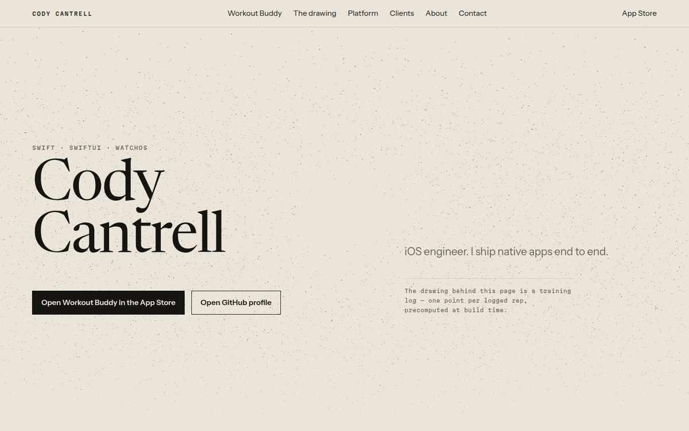

# Cody Cantrell — portfolio

A one-page portfolio for a self-taught iOS engineer. Light editorial layout,
self-hosted variable type, and one persistent WebGL canvas that draws two years
of real training data as a plotter-style ink field.



The site is the code sample. It is meant to be beautiful *and* to survive
DevTools: no third-party requests, no analytics, no cookies, and it works with
JavaScript off, WebGL unavailable, or reduced motion set.

---

## Commands

| | |
|---|---|
| `npm run dev` | local dev |
| `npm run build` | production build — must pass before any commit |
| `npm run lint && npm run typecheck` | run both before committing |
| `npm run test:e2e` | Playwright smoke tests against a production build |
| `npm run lh` | Lighthouse against the production build, with the budget enforced |
| `npm run data` | rebuild the field from `data/training.json` (runs on `prebuild`) |
| `npm run fonts` | re-subset the fonts (needs `pip install fonttools brotli`) |

---

## Architecture

**Next.js App Router, TypeScript strict, Tailwind v4.** One page, anchor
navigation. Everything is statically prerendered; the page revalidates daily so
the GitHub figures stay current.

### The field

One canvas, mounted once, fixed behind the document, driven by a scroll
progress value. There are no per-section scenes — the scroll position is a
uniform, not a new scene graph.

```
data/training.json                 real logged sets: date, lift, weight, reps
        │
        │  scripts/build-field-data.mjs   (runs at build time)
        ▼
public/field/field-v1.bin          18,067 points × 6 bytes  →  13KB gzipped
public/field/manifest.json         counts, ranges, the two R2 constants
public/field/poster.svg            the static frame, same points, same maths
public/field/trend.svg             the progression curve, for the link-preview image
lib/generated/field-stats.ts       the figures the page states in prose
        │
        ▼
components/field/                  ~350 lines of WebGL: one program, one draw call
```

Every point is one logged rep. Nothing calls `Math.random()`.

The wire format is three `Uint16`s per point — quantised time, quantised
intensity, and a packed word holding the lift index, the set volume and the rep
index. The browser parses no JSON and computes no positions; it widens integers
into floats and uploads them.

Scatter positions are not stored at all. They come from the **R2
low-discrepancy sequence** — `fract(i × 0.7548…)`, `fract(i × 0.5698…)` — which
scatters far more evenly than hash noise (no clumps, no visible lattice, which
is what a plotter drawing wants) and is reproducible from a vertex index alone.
The static poster runs the same two constants, so the fallback and the live
canvas are the same drawing.

### Layers

| Path | What lives there |
|---|---|
| `app/tokens.css` | every colour, type step, space step and easing. **Never hardcode a hex in a component.** |
| `app/globals.css` | maps tokens into Tailwind's theme namespaces via `@theme inline` |
| `content/` | all copy. `profile.ts` holds the only remaining `TODO(owner)` fields |
| `components/field/` | the canvas, the GLSL, the buffer loader |
| `components/motion/` | Lenis + GSAP. Renders nothing |
| `lib/generated/` | build output — do not edit |
| `scripts/` | the build-time pipelines: field data, font subsetting, placeholder data |

---

## Performance budget

Enforced by Lighthouse CI in GitHub Actions. A regression fails the build.

| | Budget | Measured |
|---|---|---|
| Performance | ≥ 90 | **96–98** |
| Accessibility | 100 | **100** |
| Best Practices | ≥ 95 | **100** |
| SEO | 100 | **100** |
| LCP | < 2.0s | **1.0s** |
| CLS | < 0.05 | **0.008** |
| TBT | < 250ms | **150–230ms** |
| First-view transfer | < 1.5MB | **444KB** |

Measured on Lighthouse's mobile profile (1.6Mbps, 150ms RTT, 4x CPU) with
`throttlingMethod: 'devtools'` — the throttling actually applied rather than
modelled. See the note at the top of `lighthouserc.cjs` for why.

How it stays there:

- **Fonts are subset and axis-limited.** Three variable faces, 107KB total.
  Newsreader keeps its `opsz` axis — that is why it is the display face, since
  the ~69px section titles get a design drawn for display sizes rather than a
  scaled-up text cut — but its weight axis is trimmed to 400–600, which strips
  the unused deltas out of `gvar` and takes it from 129KB to 55KB.
- **No 3D library.** This began on three.js and react-three-fiber. It drew
  correctly, but cost 230KB over the wire and ~1.4s of script evaluation on a
  throttled mobile profile — Lighthouse 0.69, LCP 3.0s. The field needs one
  shader program, two buffers and a loop, so `components/field/renderer.ts`
  is written directly against WebGL. Same output, same hand-written GLSL,
  ~4KB. That single change took performance from 0.69 to 0.96.
- **The canvas is deferred past load.** It sits behind a dynamic import that is
  not requested until after `load`, during idle time. The static poster is
  server-rendered, so there is never a blank rectangle.
- **DPR capped at 1.75**, one draw call, no postprocessing, point density
  drops automatically when frame times slip, and the render loop is cancelled
  entirely — not merely skipped — when the tab is hidden.
- **Only transform and opacity animate.** One easing family, shared between CSS
  and GSAP as literally the same four control points (`lib/ease.ts`).

---

## Degradation

All four paths are tested in `e2e/smoke.spec.ts`, not assumed.

| Condition | Behaviour |
|---|---|
| JavaScript off | Full page, real text, static ink poster |
| WebGL unavailable | Same, plus reveals and smooth scroll |
| `prefers-reduced-motion` | Everything visible immediately, no canvas, no Lenis |
| ≤ 2 CPU cores | No canvas; the poster stands in |
| WebGL context lost | The poster fades back in |

The reveal animation hides elements only under `html.js`, and an inline head
script drops that class if the motion layer has not taken over within 2.5
seconds. A portfolio that renders blank because a CDN blipped is worse than one
that does not animate.

---

## Payments

`/pay` takes a one-off invoice payment or sets up a monthly retainer. It is a
separate route, not a panel in the deck — the deck is the portfolio, and this
is a tool for someone who has already decided. The front page's bundle is
untouched by it.

**No card fields, no Stripe.js, no `stripe` package.** The page posts an
ordinary form, the server creates a Checkout Session over the REST API, and the
browser is 303'd to Stripe. Card details never touch this site, and the whole
flow works with JavaScript off — which `e2e/pay.spec.ts` asserts, because a
payment page is where that principle stops being a principle and becomes
someone unable to pay an invoice.

| Route | |
|---|---|
| `/pay` | The two forms. `noindex`. |
| `/pay/done` | Confirmation. Re-fetches the session from Stripe — it never believes the URL. |
| `/api/checkout` | Creates the Checkout Session, 303s to Stripe. |
| `/api/portal` | Opens Stripe's billing portal so a retainer can be cancelled without asking. |
| `/api/stripe/webhook` | Verified events. This is the only way renewals and failed cards are ever heard about. |

All five are `.server.tsx` / `.server.ts` files. `next.config.ts` puts that
extension in `pageExtensions` **only** for the server-rendered build, so none of
them exist in the GitHub Pages export (`npm run build:pages`) — that build has
no server, and Next fails an export outright rather than skipping a dynamic
route. The Contact panel's link to `/pay` is hidden in that build for the same
reason.

### Setting it up

Two secrets. Neither is ever committed; `.dev.vars` and `.env*` are gitignored.

```
npx wrangler secret put STRIPE_SECRET_KEY      # sk_live_... or sk_test_...
npx wrangler secret put STRIPE_WEBHOOK_SECRET  # whsec_...
```

For local work, put the same two in `.dev.vars` (see `.dev.vars.example`).

Then, in the Stripe dashboard:

1. **Webhook endpoint** → `https://codycantrell.dev/api/stripe/webhook`.
   Subscribe at least to `checkout.session.completed`, `invoice.paid`,
   `invoice.payment_failed` and `customer.subscription.deleted`. Copy the
   signing secret it gives you into `STRIPE_WEBHOOK_SECRET`.
2. **Customer portal** → configure it (Settings → Billing → Customer portal),
   or `/api/portal` will fail with a plain API error. Turning on its email login
   link is also what gives a returning client a way back into their own billing
   weeks later; this site deliberately has no "look me up by email" endpoint,
   because that would let anyone open the portal for any address they can guess.

With no key configured the page still builds, still renders, and says payments
are not switched on — so a fresh clone with no Stripe account passes CI.

### Sending an invoice

`/pay` is the self-serve door: someone who already knows the amount pays it
now. Money a client *owes* is a different job, and `scripts/invoice.mjs` does
that one — it drives Stripe Invoicing, so you get a real invoice number, a PDF,
a due date, and Stripe's reminder and retry machinery. Neither replaces the
other and the script does not touch the site.

```
node scripts/invoice.mjs --to client@acme.com --name "Acme" \
  --amount 2500 --for "Landing page design and build" --due 14
```

That creates and finalizes the invoice and prints its hosted payment link and
PDF. **Nothing is emailed.** The intended flow is to paste that link into a
draft email and send it yourself, so the client hears from you rather than from
Stripe. Add `--send` if you would rather Stripe email it directly.

Amounts go in as dollars and are parsed to cents by the same integer rule as
the payment route — `2500`, `2500.00`, `$2,500` all work; anything ambiguous is
rejected rather than rounded.

### Test keys and live keys live in different files

| file | holds | read by |
|---|---|---|
| `.dev.vars` | the **test** key | the dev server, and `invoice.mjs` by default |
| `.stripe-live` | the **live** key | `invoice.mjs --live`, and nothing else |

This split is deliberate and worth keeping. `.dev.vars` is loaded by the dev
server, so a live key in it would mean a test payment on localhost silently
charging a real card. Billing a real client should be something you opt into by
name — `--live` — not something you can drift into by having the wrong file
open. Both files are gitignored.

Two more guards, because an invoice is only half-reversible — voiding one does
not unsend the email a client has already read:

- nothing is emailed without `--send`;
- on a live key, `--send` also requires `--yes`, and the refusal prints the
  recipient and amount first.

### Testing it

`npm run test:e2e` covers the whole validation layer with **no key required**:
every amount that must be rejected is rejected before Stripe is contacted. Run
the rest against a `sk_test_...` key with Stripe's test cards — `4242 4242 4242
4242` succeeds, `4000 0000 0000 9995` is declined.

To exercise the webhook locally, `stripe listen --forward-to
localhost:3000/api/stripe/webhook` prints its own `whsec_` — use that one in
`.dev.vars`, not the dashboard's.

### Two things worth knowing before changing this

- **The amount is parsed as integers, never as a float** (`lib/money.ts`).
  `parseFloat('11.90') * 100` is `1189.9999999999998`. Whatever replaces that
  parser has to keep every case in `e2e/pay.spec.ts` deciding the same way.
- **No API version is pinned.** Requests use the account's default version, and
  the response fields this site reads (`status`, `payment_status`, `mode`,
  `amount_total`, `currency`, `customer`, `subscription`) have been stable
  across many versions. If you'd rather pin one, add a `Stripe-Version` header
  in `lib/stripe.ts` — one line, in `request()`.

The floor and ceiling on what will be accepted ($5 and $50,000) live in
`content/pay.ts` next to the copy that states them, so the page can never
promise a range the server does not enforce. The ceiling is a typo guard, not a
business limit.

---

## Before this goes live

Open `content/profile.ts` and fill the `TODO(owner)` fields — LinkedIn, résumé
PDF, production domain. Then:

- `content/projects.ts` — **read the architecture notes and the four technical
  decisions.** They were drafted from the feature list and are claims about your
  code. An engineer who likes the site will ask about them in an interview.
- `data/training.json` — replace with the real Workout Buddy export. Same
  schema, and no code change needed elsewhere: the canvas only ever draws an
  abstract scatter, so there is no first-person claim about the data to keep
  in sync.
- `public/media/` — drop in `workout-buddy-1..4.png` and, if you have it,
  `workout-buddy-demo.mp4`. The frames already reserve their aspect ratio, so
  adding the real assets cannot shift the layout. No code change.
- `GITHUB_TOKEN` in the Vercel environment is optional; it only raises the rate
  limit on the build-time repo fetch. Without it the fetch still works, and if
  it fails the section is omitted rather than showing stale numbers.

---

## Licences

Newsreader, Instrument Sans and Martian Mono are OFL-1.1; the licences ship
alongside the subset files in `public/fonts/`.
